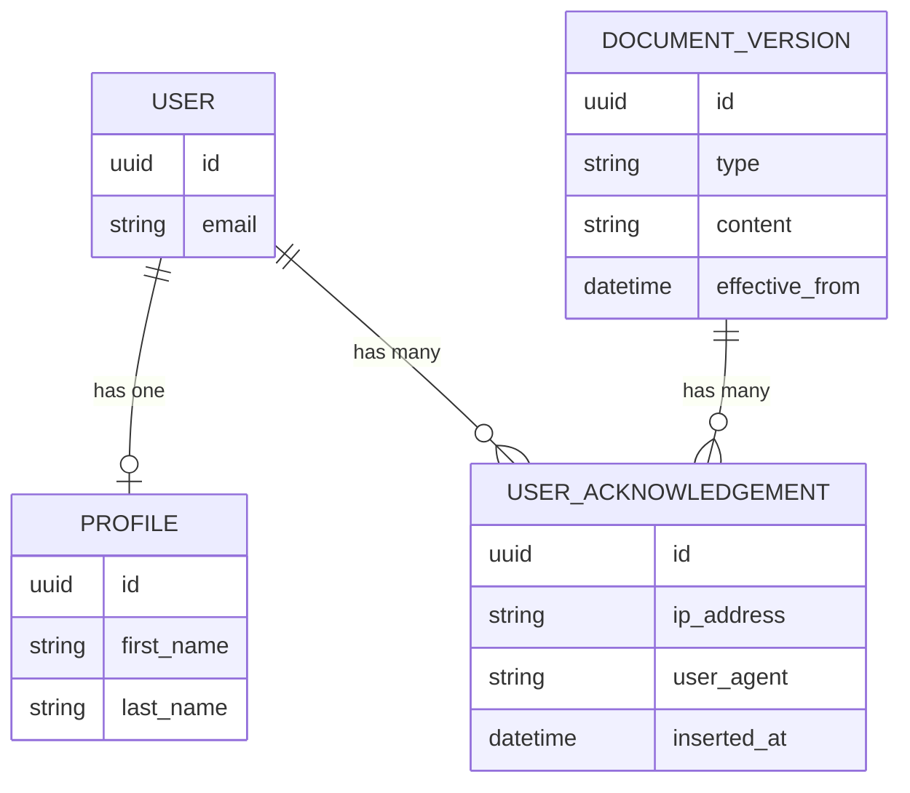
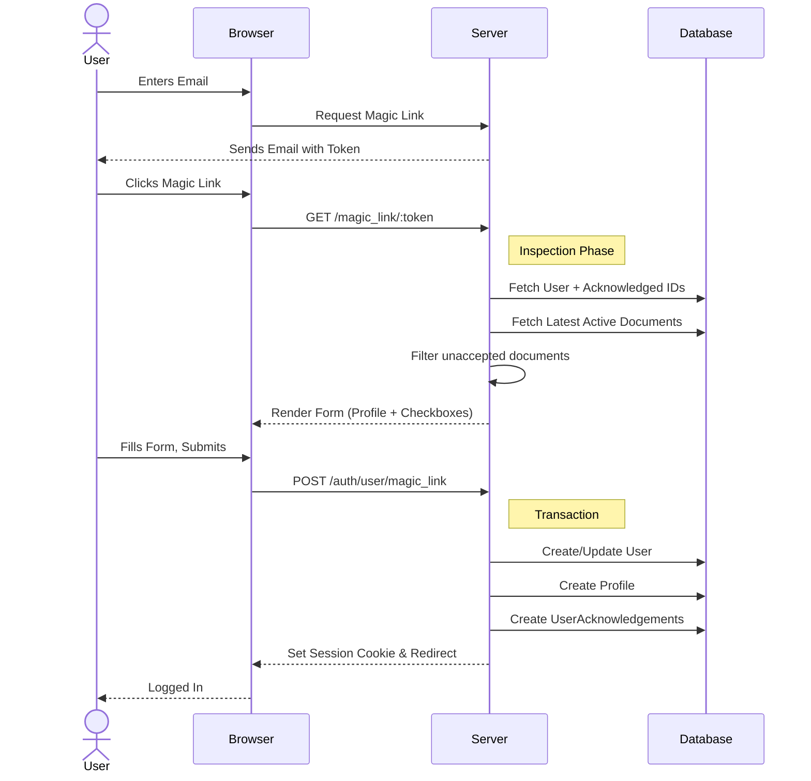

# Ash Authentication - Customize Magic Link (Part 2)

In [Part 1](https://coding-individuals.at/en/blog/custom_ash_authentication_part_1), we set up a custom Magic Link workflow that enforces profile creation (First Name/Last Name) upon registration.

In **Part 2**, we tackle a critical requirement for modern applications: **Compliance**. Whether it is GDPR, Terms of Service, or a Privacy Policy, you often need to prove *exactly when* a user agreed to a specific version of a document.

We will expand our application to:

1. Manage versioned legal documents.
2. Capture request metadata (IP Address and User Agent) for audit trails.
3. Intercept the Magic Link registration to enforce document acknowledgment.

## Designing the Legal Domain

We need a system that tracks different types of documents (e.g., Privacy Policy, Terms) and versions them. We also need to track who agreed to which version.



### The Document Version Resource

First, we create a resource to hold the text content of our legal documents. We use an `effective_from` date to handle versioning, allowing us to draft new policies before they go live.

Run the generator:
```shell
mix ash.gen.resource CustomizeAshAuthentication.Legal.DocumentVersion \
  --uuid-primary-key id \
  --attribute content:string:required:public \
  --attribute effective_from:utc_datetime \
  --attribute type:atom \
  --timestamps \
  --extend postgres
```

Now, let's refine the resource. We need specific read actions to find the *currently active* version of a specific document type (e.g., the latest Privacy Policy).

We restrict types to ensure consistency.
```elixir
# lib/customize_ash_authentication/legal/document_version.ex

attributes do
  # ... generated attributes
  attribute :type, :atom do
    constraints one_of: [:privacy_policy, :terms_of_service]
    allow_nil? false
  end
end

actions do
  defaults [:read]
  
  create :create do
    primary? true
    accept [:content, :type, :effective_from]
  end

  read :get_latest_by_type do
    get? true

    argument :type, :atom do
      allow_nil? false
    end

    filter expr(type == ^arg(:type) and effective_from < now())
    prepare build(sort: [effective_from: :desc], limit: 1)
  end

  read :list_latest do
    filter expr(effective_from < now())
    prepare build(distinct: [:type], distinct_sort: [effective_from: :desc])
  end
end
```

Generate and run the migration:
```shell
mix ash.codegen add_document_version
mix ash.migrate
```

### The User Acknowledgement Resource

This resource acts as the link between a `User` and a `DocumentVersion`. It serves as the immutable audit log.

Run the generator:
```shell
mix ash.gen.resource CustomizeAshAuthentication.Legal.UserAcknowledgement \
  --uuid-primary-key id \
  --attribute ip:string:required \
  --attribute user_agent:string:required \
  --relationship belongs_to:user:CustomizeAshAuthentication.Accounts.User:required \
  --relationship belongs_to:document_version:CustomizeAshAuthentication.Legal.DocumentVersion:required \
  --extend postgres
```

We need to make a few adjustments to this resource. We will add a `create_timestamp` to record *when* they agreed, and add a unique identity so a user doesn't sign the exact same version twice. If a user is deleted, their acknowledgements go with them. We do not delete document versions, therefore we do not cascade deletions on acknowledgements.
```elixir
# lib/customize_ash_authentication/legal/user_acknowledgement.ex

postgres do
  table "user_acknowledgements"
  repo CustomizeAshAuthentication.Repo

  references do
    # If a user is deleted, their acknowledgements go with them.
    # We DO NOT cascade delete on document_version; legal history must be preserved.
    reference :user, on_delete: :delete, index?: true
    reference :document_version, index?: true
  end
end

attributes do
  # ... existing attributes
  create_timestamp :inserted_at
end

identities do
  identity :unique_user_document_version, [:user_id, :document_version_id]
end
```

Generate and run the migration:
```shell
mix ash.codegen add_user_acknowledgement
mix ash.migrate
```

### Connecting the User

Now, update the User resource to make these relationships accessible. We also add an `aggregate`. This is a performance optimization that allows us to get a list of IDs of documents the user has signed without loading all the associated data rows.
```elixir
# lib/customize_ash_authentication/accounts/user.ex

relationships do
  # ... existing code

  has_many :acknowledgements, CustomizeAshAuthentication.Legal.UserAcknowledgement

  many_to_many :document_version_acknowledgements,
               CustomizeAshAuthentication.Legal.DocumentVersion do
    join_relationship :acknowledgements
  end
end

aggregates do
  list :acknowledged_document_version_ids, :document_version_acknowledgements, :id
end
```


## Capturing Metadata (IP & User Agent)

For a legal acknowledgement to hold weight, we should capture the context of the request. In Phoenix/Ash, we can capture the IP address and User Agent in a `Plug` and pass it to the Ash Context. To achieve that we use the `:shared` key which will be propagated through managed relationships as documented [`here`](https://hexdocs.pm/ash/actions.html#shared).

We will also use `AshAuthentication.AddOn.AuditLog.IpPrivacy` to anonymize the IP address (truncating it), ensuring we don't violate privacy laws while trying to comply with others.

Note: Ensure you remove the original `auth_routes` line from your main scope. We are moving it into this new scope to apply the metadata plug specifically to authentication actions.

```elixir
# lib/customize_ash_authentication_web/router.ex

defp put_ash_request_context_metadata(conn, _opts) do
  ip =
    conn.remote_ip
    |> :inet.ntoa()
    |> to_string()
    |> AshAuthentication.AddOn.AuditLog.IpPrivacy.apply_privacy(:truncate, %{})

  user_agent =
    conn
    |> Plug.Conn.get_req_header("user-agent")
    |> List.first()

  Ash.PlugHelpers.set_context(conn, %{shared: %{client_ip: ip, user_agent: user_agent}})
end

scope "/", CustomizeAshAuthenticationWeb do
  pipe_through [:browser, :put_ash_request_context_metadata]
  
  auth_routes AuthController, CustomizeAshAuthentication.Accounts.User, path: "/auth"
end
```

> **Note:** This customization requires **Ash Authentication v4.13.8** or later to work correctly due to a bug in previous versions regarding the `:shared` context.
> If necessary, update your `mix.exs`: `{:ash_authentication, "~> 4.13.8"}` or `{:ash_authentication, github: "team-alembic/ash_authentication", branch: "main", override: true}` .

## The Acknowledgement Logic

Now we configure the `UserAcknowledgement` resource to pull that metadata out of the context and save it automatically when a record is created.

```elixir
# lib/customize_ash_authentication/legal/user_acknowledgement.ex

actions do
  defaults [:read]
  
  create :create do
    primary? true
    accept [:document_version_id]
  
    argument :accepted, :boolean do
      allow_nil? false
    end
  
    change before_action(fn %{context: context} = changeset, _context ->
             changeset
             |> Ash.Changeset.force_change_attribute(:ip, context[:client_ip])
             |> Ash.Changeset.force_change_attribute(:user_agent, context[:user_agent])
           end)
  
    validate argument_equals(:accepted, true),
      message: "An acknowledgment is required"
  end
end
```

### Exposing the Code Interface

To make our LiveView easier to write, we expose specific actions via the Code Interface:
```elixir
# lib/customize_ash_authentication/legal.ex

resource CustomizeAshAuthentication.Legal.DocumentVersion do
  define :list_latest_document_versions,
    action: :list_latest
      
  define :create_document_version,
    action: :create,
    args: [:content, :type, {:optional, :effective_from}]
    
  define :get_latest_document_version_by_type,
    action: :get_latest_by_type,
    args: [:type]
end
```

### Updating the User Sign-In Action

Finally, update the User resource to accept these acknowledgements during the Magic Link sign-in process.

```elixir
# lib/customize_ash_authentication/accounts/user.ex

create :sign_in_with_magic_link do
  # ... existing profile arguments
  
  argument :acknowledgements, {:array, :map}
  
  # ... existing profile changes
  
  change manage_relationship(:acknowledgements, type: :create)
end
```


## The Magic Link LiveView

This is where everything comes together. When the user clicks the Magic Link, we check which active documents they haven't signed yet and present them in the form.




### Loading User Data

We need to load the `acknowledged_document_version_ids` aggregate when we fetch the user.

```elixir
# lib/customize_ash_authentication_web/live/magic_sign_in.ex

defp assign_user_assigns(%{assigns: %{email: email}} = socket) do
  case Accounts.get_user_by_email!(email,
         load: [
           :acknowledged_document_version_ids,
           profile: [:first_name, :last_name, :full_name]
         ],
         not_found_error?: false,
         authorize?: false
       ) do
    nil ->
      socket
      |> assign(:profile, %{})
      |> assign(:acknowledged_document_version_ids, []) # New user has signed nothing
      |> assign(:action_label, label(true))
      |> assign(:name, nil)

    user ->
      socket
      |> assign(:profile, profile_to_map(user.profile))
      |> assign(:acknowledged_document_version_ids, user.acknowledged_document_version_ids)
      |> assign(:action_label, label(false))
      |> assign(:name, if(user.profile, do: user.profile.full_name, else: nil))
  end
end
```

### Preparing the Form

We calculate which documents are missing and pre-fill the form params. AshPhoenix will see these params and generate the necessary nested form structures.
```elixir
# lib/customize_ash_authentication_web/live/magic_sign_in.ex

defp assign_form(
       %{
         assigns: %{
           token: token,
           acknowledged_document_version_ids: acknowledged_document_version_ids,
           profile: profile
         }
       } = socket
     ) do
  # 1. Fetch all currently active document versions
  # 2. Filter out the ones the user ID list already contains
  document_versions =
    CustomizeAshAuthentication.Legal.list_latest_document_versions!()
    |> Enum.filter(fn document_version ->
      document_version.id not in acknowledged_document_version_ids
    end)

  # Prepare the params for the form. 
  # We set 'accepted' to false initially so the user must click it.
  acknowledgements =
    document_versions
    |> Enum.map(fn document_version ->
      %{
        accepted: false,
        document_version_id: document_version.id
      }
    end)

  form =
    AshPhoenix.Form.for_create(
      User,
      :sign_in_with_magic_link,
      params: %{
        profile: profile, 
        acknowledgements: acknowledgements, 
        token: token
      },
      as: "user",
      load: [:profile, :acknowledgements],
      forms: [
        profile: [
          type: :single,
          resource: Profile,
          create_action: :create_on_registration
        ],
        acknowledgements: [
          type: :list,
          resource: CustomizeAshAuthentication.Legal.UserAcknowledgement,
          create_action: :create
        ]
      ]
    )

  socket
  |> assign(:form, to_form(form))
  |> assign(:document_versions, document_versions)
end
```

### Rendering the Form

We use `inputs_for` to loop over the required acknowledgements. We also use a helper `acknowledgement_label` to generate a link to the document. For simplicity we'll just transform the type atom to the title. But normally you should use something like `Gettext` to handle the labels properly.

**Note:** Generating HTML in a helper and using `raw()` carries security risks (XSS). Ensure that the data passed into the string (like `@type`) is controlled by you, or sanitize it properly.
```elixir
# lib/customize_ash_authentication_web/live/magic_sign_in.ex

def render(assigns) do
  ~H"""
  <!-- ... form with other inputs -->
  <.inputs_for :let={acknowledgement} field={@form[:acknowledgements]}>
    <input
      type="hidden"
      name={acknowledgement[:document_version_id].name}
      value={acknowledgement[:document_version_id].value}
    />
    <.input
      field={acknowledgement[:accepted]}
      type="checkbox"
      label={
        @document_versions |> Enum.at(acknowledgement.index) |> acknowledgement_label()
      }
    />
  </.inputs_for>
  <!-- ... submit button -->
  """
end

defp acknowledgement_label(%{effective_from: effective_from, type: type}),
  do: """
  I accept the
  <a href=#{~p"/documents/#{type}"} class="underline" target="_blank">
  #{type |> Atom.to_string() |> CustomizeAshAuthenticationWeb.DocumentController.type_to_title()}.
  </a>
  Effective since: #{effective_from |> DateTime.to_date() |> Date.to_string()}
  """
```

*Note: You may need to update your `core_components.ex` `input` function to support `Phoenix.HTML.raw(@label)` inside the checkbox label span, or the HTML tags will be escaped and visible to the user.*

See the following snippet.

```elixir
# lib/customize_ash_authentication_web/components/core_components.ex
 
def input(%{type: "checkbox"} = assigns) do
  assigns =
    assign_new(assigns, :checked, fn ->
      Phoenix.HTML.Form.normalize_value("checkbox", assigns[:value])
    end)

  ~H"""
  <div class="fieldset mb-2">
    <label>
      <input type="hidden" name={@name} value="false" disabled={@rest[:disabled]} />
      <span class="label">
        <input
          type="checkbox"
          id={@id}
          name={@name}
          value="true"
          checked={@checked}
          class={@class || "checkbox checkbox-sm"}
          {@rest}
        />
        {Phoenix.HTML.raw(@label)}
      </span>
    </label>
    <.error :for={msg <- @errors}>{msg}</.error>
  </div>
  """
end
```


## Displaying the Documents

We need a controller to actually render the document content when the user clicks the link in the checkbox label.

```elixir
# lib/customize_ash_authentication_web/controllers/document_controller.ex

defmodule CustomizeAshAuthenticationWeb.DocumentController do
  use CustomizeAshAuthenticationWeb, :controller
  alias CustomizeAshAuthentication.Legal

  plug :put_layout, false

  def show(conn, %{"type" => type}) do
    case Legal.get_latest_document_version_by_type(type) do
      {:ok, document} ->
        render(conn, :show, content: document.content, title: type_to_title(type))

      _ ->
        conn
        |> put_flash(:error, "Document not available.")
        |> redirect(to: ~p"/")
    end
  end

  # A simple helper to pretty-print the original atom (e.g. :privacy_policy -> "Privacy Policy")
  def type_to_title(type) when is_binary(type) do
    type
    |> String.split("_")
    |> Enum.map(&String.capitalize/1)
    |> Enum.join(" ")
  end
end
```

```elixir
# lib/customize_ash_authentication_web/controllers/document_html.ex

defmodule CustomizeAshAuthenticationWeb.DocumentHTML do
  use CustomizeAshAuthenticationWeb, :html

  def show(assigns) do
    ~H"""
    <div class="grid min-h-screen place-items-center bg-base-100 py-12 px-4">
      <div class="mx-auto w-full max-w-2xl">
        <h1 class="text-2xl sm:text-3xl lg:text-4xl py-6 flex justify-center">{@title}</h1>
        <div class="p-6">
          {raw(@content)}
        </div>
      </div>
    </div>
    """
  end
end
```

Add the route to `router.ex`:
```elixir
# lib/customize_ash_authentication_web/router.ex

scope "/", CustomizeAshAuthenticationWeb do
  pipe_through :browser
  
  # ... existing routes 
  
  get "/documents/:type", DocumentController, :show
end
```


## Testing

Let's verify the workflow. Start your server with `iex -S mix phx.server` and create a dummy document version:
```elixir
CustomizeAshAuthentication.Legal.create_document_version!(
  "<p>Your deepest secrets will be revealed to the universe.</p>", 
  :privacy_policy, 
  DateTime.utc_now()
)
```
And another one:

```elixir
CustomizeAshAuthentication.Legal.create_document_version!(
  "<p>After death, ownership of your soul will be claimed by the Devil.</p>", 
  :terms_of_service, 
  DateTime.utc_now()
)
```

1. Navigate to [`http://localhost:4000/sign-in`](http://localhost:4000/sign-in).
2. Enter your email.
3. Navigate to the development mailbox [`http://localhost:4000/dev/mailbox`](http://localhost:4000/dev/mailbox) for the link.
4. Click the link. You should see the **First Name** and **Last Name** fields (from Part 1) AND a checkbox for the **Privacy Policy** and the **Terms of Service**.
5. If you try to submit without checking the box, validation will fail.
6. Once you submit, check the database (or Ash Resource). You will see a `UserAcknowledgement` record containing your (anonymized) IP and User Agent.

### Conclusion

You now have a fully compliant "Just-In-Time" registration flow. The user is only persisted when they have provided all necessary profile data and legally agreed to your terms.

It also forces existing users to re-accept new versions of terms when they next log in. But if you have a long living token, they might use your service without re-accepting the new terms for a while.
